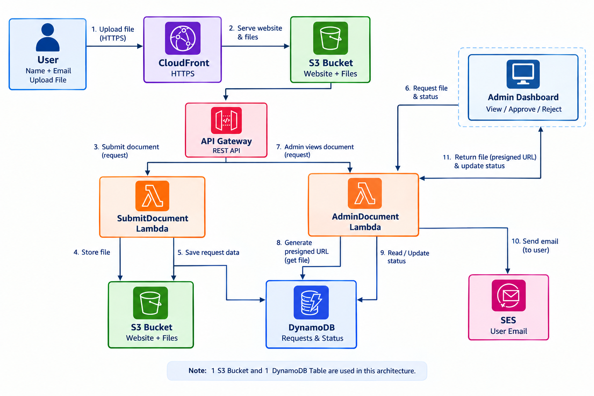
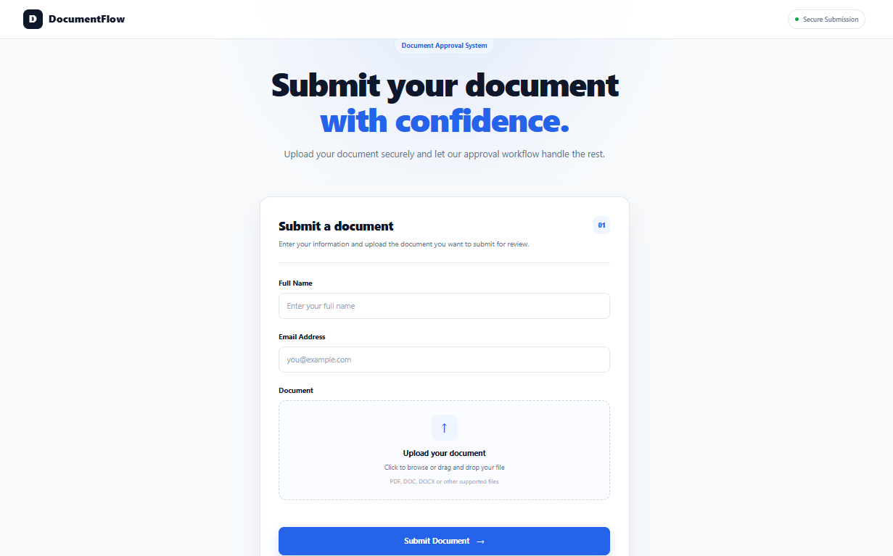
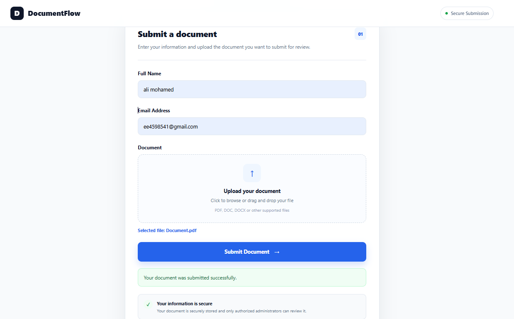
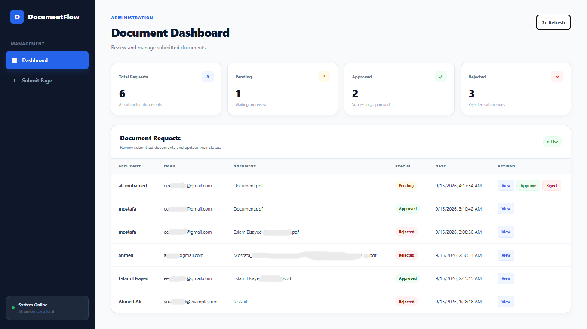
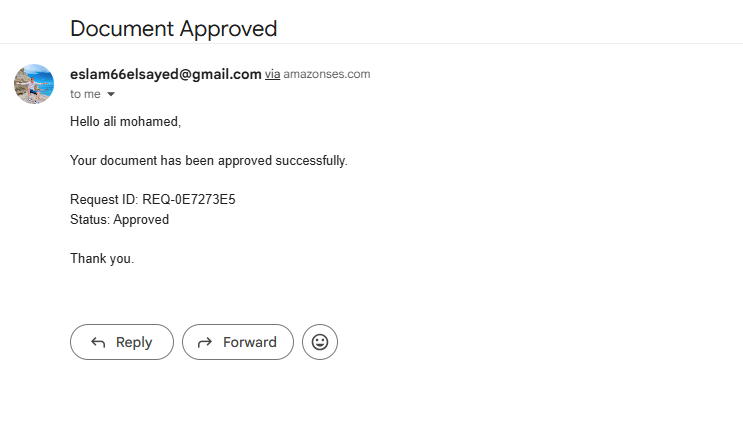
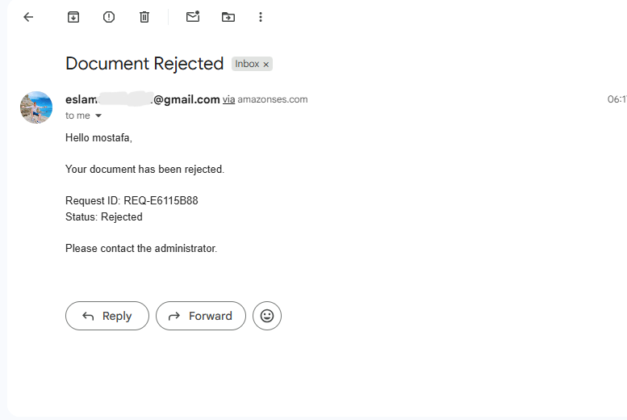

# 📄 Document Approval System

A serverless AWS application for submitting, reviewing, and approving documents through a simple web-based workflow.

Users can submit their information and upload a document, while administrators can review requests from a dedicated dashboard, view documents, and approve or reject submissions.

---
## 🚀 Project Overview

The Document Approval System is a serverless AWS project designed to demonstrate how multiple AWS services can work together to build a secure and scalable document workflow.

Main Workflow
```text
User
  │
  │ Name + Email + Document
  ▼
CloudFront
  │
  ▼
S3
  │
  ▼
API Gateway
  │
  ▼
SubmitDocumentLambda
  │
  ├──► S3
  │     └── Store Document
  │
  └──► DynamoDB
        └── Store Request
              │
              ▼
       Admin Dashboard
              │
        ┌─────┴─────┐
        ▼           ▼
     Approve      Reject
        │           │
        └─────┬─────┘
              ▼
     AdminDocumentLambda
              │
        ┌─────┴─────┐
        ▼           ▼
    DynamoDB       SES
   Update Status    │
                    ▼
               User Email
```

## 🏗️ Architecture



---

## 📸 Project Screenshots

### User interface


### Submission Success


### Admin Dashboard


### Approval Result


### Rejection Result


---

## ✨ Key Features

- User document submission
- File upload to Amazon S3
- Request tracking with DynamoDB
- Admin dashboard
- Document preview using Presigned URLs
- Approve / Reject functionality
- Email notification using Amazon SES
- HTTPS delivery through CloudFront
- Private S3 bucket
- Only **two Lambda functions**
- Single S3 bucket
- Single DynamoDB table

---

## ☁️ AWS Services

| AWS Service | Role |
|---|---|
| **Amazon S3** | Hosts frontend files and stores uploaded documents |
| **Amazon CloudFront** | HTTPS and CDN for the frontend |
| **Amazon API Gateway** | REST API for frontend/backend communication |
| **AWS Lambda** | Application backend logic |
| **Amazon DynamoDB** | Stores requests and statuses |
| **Amazon SES** | Sends decision emails to users |
| **AWS IAM** | Controls permissions |
| **Amazon CloudWatch** | Lambda logging and monitoring |

---

## 🔄 How It Works

### 1. User Submission

The user enters:

- Full Name
- Email Address
- Document

The request is sent to:

```text
CloudFront
    ↓
S3 Frontend
    ↓
API Gateway
    ↓
SubmitDocumentLambda
```

The Lambda function then:

```text
Document → S3
Request  → DynamoDB
```

---

### 2. Admin Review

The administrator opens the Admin Dashboard.

The dashboard retrieves requests through:

```text
Admin Dashboard
      ↓
API Gateway
      ↓
AdminDocumentLambda
      ↓
DynamoDB
```

The administrator can:

- View requests
- View submitted documents
- Approve requests
- Reject requests

---

### 3. Document Viewing

Documents remain private in S3.

When the administrator clicks **View**, the Lambda generates a temporary Presigned URL.

```text
Admin Dashboard
      ↓
AdminDocumentLambda
      ↓
Amazon S3
      ↓
Presigned URL
      ↓
Document
```

---

### 4. Approval / Rejection

When the administrator makes a decision:

```text
Admin Dashboard
      ↓
AdminDocumentLambda
      ↓
DynamoDB
      ↓
Update Status
```

The possible statuses are:

```text
Pending
Approved
Rejected
```

After the decision, SES sends an email to the user.

```text
AdminDocumentLambda
      ↓
Amazon SES
      ↓
User Email
```

---

# 🔌 API Endpoints

| Method | Endpoint | Purpose |
|---|---|---|
| `POST` | `/submit` | Submit a document |
| `GET` | `/admin/requests` | Retrieve all requests |
| `GET` | `/admin/document` | Generate document Presigned URL |
| `POST` | `/admin/decision` | Approve or reject a request |

---

# 📁 Repository Structure

```text
Document-Approval-System/
│
├── frontend/
│   ├── index.html
│   ├── admin.html
│   ├── style.css
│   ├── script.js
│   └── admin.js
│
├── SubmitDocumentLambda/
│   ├── lambda_function.py
│   └── README.md
│
├── AdminDocumentLambda/
│   ├── lambda_function.py
│   └── README.md
│
├── images/
│   ├── architecture.png
│   ├── user-page.png
│   └── admin-dashboard.png
│
├── docs/
│   └── AWS-Setup.md
│
└── README.md
```

---

# 🗄️ Database

## DynamoDB

Table name:

```text
document-requests
```

Partition key:

```text
request_id
```

Example item:

```json
{
  "request_id": "REQ-123456",
  "name": "John Doe",
  "email": "john@example.com",
  "document_key": "documents/REQ-123456/document.pdf",
  "status": "Pending",
  "created_at": "2026-09-16T12:00:00Z"
}
```

---

# 🪣 S3 Structure

The project uses **one S3 bucket** for both the website and uploaded documents.

```text
S3 Bucket
│
├── index.html
├── admin.html
├── style.css
├── script.js
├── admin.js
│
└── documents/
    ├── REQ-001/
    │   └── document.pdf
    │
    └── REQ-002/
        └── document.pdf
```

The `documents/` prefix is created automatically when Lambda uploads a document.

---

# 🔐 Security

The project uses:

- S3 Block Public Access
- Private S3 bucket
- CloudFront Origin Access Control
- S3 Presigned URLs for document access
- IAM roles for Lambda permissions
- DynamoDB for request tracking
- HTTPS through CloudFront

Documents are **not publicly accessible**.

---

# 📚 Documentation

For the complete step-by-step AWS Console setup:

**[AWS Setup Guide](docs/AWS-Setup.md)**

The documentation covers:

- S3
- DynamoDB
- IAM
- Lambda
- API Gateway
- CloudFront
- SES
- Frontend configuration
- Testing

---

# 🚀 Future Improvements

- Amazon Cognito authentication
- Dedicated admin authentication
- AWS WAF
- CloudWatch alarms
- File validation
- File size restrictions
- Audit logging
- Terraform
- CI/CD
- Custom domain

---

# 🛠️ Technologies

**Frontend**

- HTML
- CSS
- JavaScript

**Backend**

- Python
- AWS Lambda

**AWS**

- Amazon S3
- Amazon CloudFront
- Amazon API Gateway
- AWS Lambda
- Amazon DynamoDB
- Amazon SES
- AWS IAM
- Amazon CloudWatch

---

# 👨‍💻 Author

**Eslam Elsayed**

AWS Cloud & Cloud Security Learner

---

⭐ Built as a hands-on AWS serverless project.
